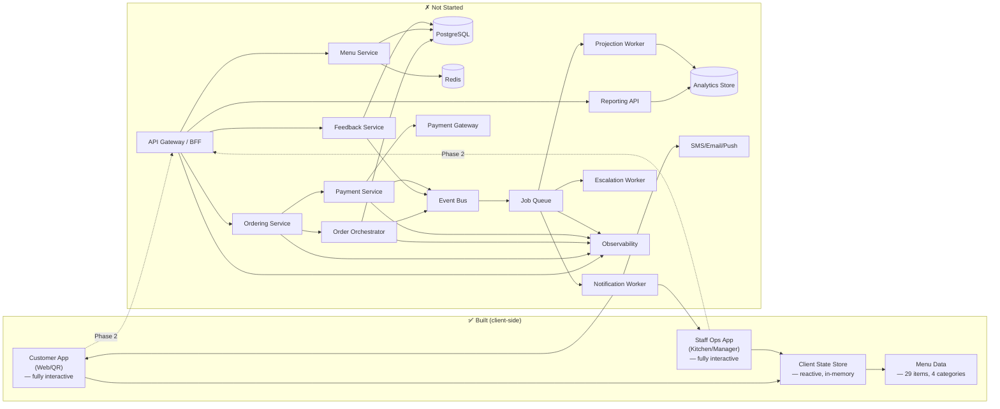
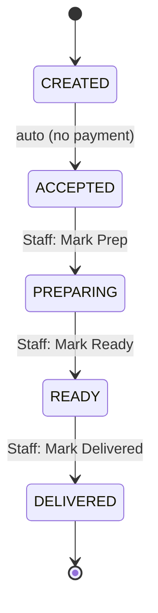
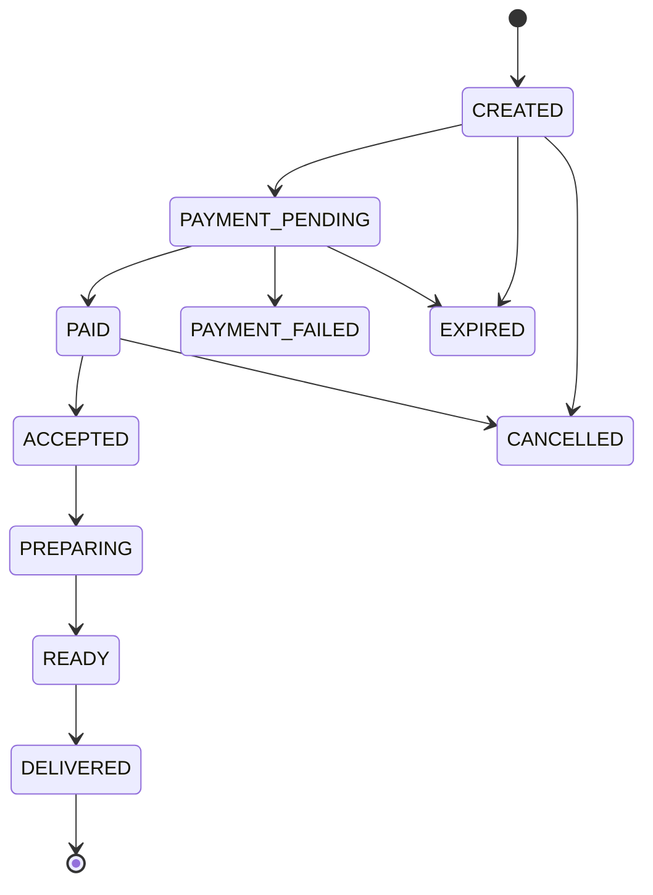
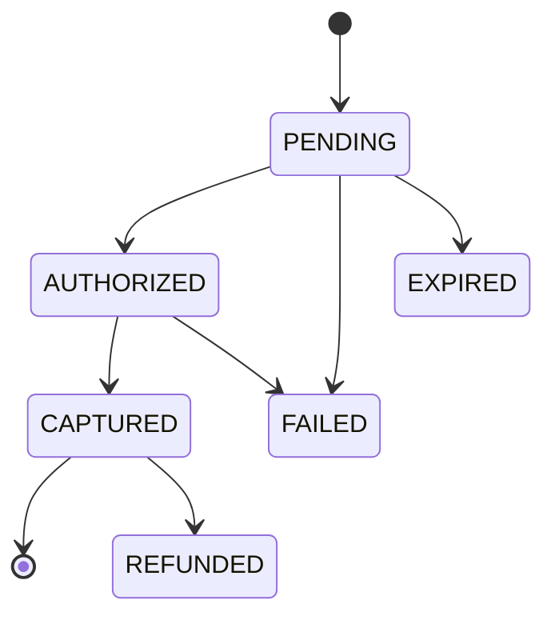

# TableFlow — Project Status

> **Phase: Interactive Prototype (Phase 1 complete)**
> All 7 screens are fully interactive with client-side state. No backend, no persistence beyond the browser session.

---

## 1) What's Built

| Layer | Status | Details |
|---|---|---|
| HTML shell | Done | Single-page app with sidebar nav + main content area |
| CSS design system | Done | Custom properties, responsive grid, component styles, animations, interactive states (hover, active, disabled), input/textarea fields, toast notifications, cart badge, star ratings, quantity controls |
| ES module architecture | Done | `app.js` orchestrator imports 7 screen modules, state store, menu data, utils, and toast system |
| State management | Done | Reactive store (`state/store.js`) with `getState()`, `update()`, `subscribe()` — batched rendering via microtask |
| Menu browsing | Done | 29 items across 4 categories with drill-down, featured item card, "Add" to cart |
| Cart + checkout | Done | Add/remove items, quantity +/-, live subtotal/tax/total, table number input, Place Order with validation |
| Order state machine | Done | CREATED → ACCEPTED → PREPARING → READY → DELIVERED (client-side, no payment step) |
| Order tracking | Done | Real timeline with Done/Active/Future stages, multi-order selector |
| Kitchen queue | Done | Tickets from live orders, Mark Prep/Ready/Delivered, computed shift metrics (open, avg prep, delayed, completed) |
| Feedback form | Done | Order selector, sentiment buttons, 1–5 star rating, textarea, submit with low-rating escalation alerts |
| Feedback inbox | Done | Populated from submitted feedback, Assign/Resolve workflow, status tracking |
| Insights dashboard | Done | All metrics computed live from orders + feedback (total orders, avg rating, low ratings, top complaint/compliment) |
| Event delegation | Done | Single delegated click handler on `#screenRoot` dispatches via `data-action` attributes |
| Toast notifications | Done | Animated toasts for user feedback on all actions |
| Cart badge | Done | Nav button shows item count when cart is non-empty |
| Responsive layout | Done | Desktop (2-col) and mobile (<960px, stacked) breakpoints |
| Typography | Done | Space Grotesk (body) + Fraunces (display) via Google Fonts |
| Screenshot tooling | Done | Puppeteer script generates 14 PNGs (7 screens x 2 viewports) |

## 2) What's Interactive

Every screen is fully functional with client-side state.

| Screen | What Works |
|---|---|
| 1. Customer Menu | Open category → browse items → Add to cart (increments qty if already in cart) → toast confirmation |
| 2. Cart + Checkout | Qty +/-, remove items, live totals (subtotal + 3.9% fee + 9% tax), table # input with validation, Place Order creates order and navigates to status |
| 3. Live Order Status | Real timeline reflecting order state, past stages "Done" with timestamp, current "Active", future stages muted, multi-order selector |
| 4. Kitchen Queue | Shows all non-delivered orders as tickets, Mark Prep/Ready/Delivered transitions state, shift metrics update in real-time |
| 5. Feedback Capture | Select delivered order, pick sentiment, rate 1–5, add comments, submit stores locally, low rating (≤2) triggers escalation alert toast |
| 6. Feedback Inbox | Populated from submitted feedback, Assign (to Shift Lead), Resolve, status badges |
| 7. Service Insights | Orders Today, Avg Rating, Low Ratings count, top complaint/compliment — all computed from live data |

## 3) What Doesn't Exist

| Component | From SYSTEM_DESIGN.md | Exists? |
|---|---|---|
| API Gateway / BFF | Auth, validation, idempotency, routing | No |
| Ordering Service | Command handlers (CreateOrder, etc.) | No — orders are client-side objects |
| Order Orchestrator | Canonical state machine, event emission | Partial — state machine runs client-side, no event bus |
| Payment Service | PSP integration, intent + capture lifecycle | No — orders skip payment |
| Menu Service | Redis-backed read model, availability, modifiers | No — static data in `data/menu.js` |
| Feedback Service | Persistence, triage, escalation events | No — feedback is in-memory |
| Reporting API | Materialized views, analytics queries | No — metrics computed on-the-fly from state |
| PostgreSQL | Operational source of truth | No |
| Redis | Hot cache, sessions, rate limiting | No |
| Event Bus | Domain event distribution | No |
| Job Queue | Async side-effect processing | No |
| Notification Worker | Push, durable inbox, replay | No — toast only |
| Projection Worker | Materialized views, analytics rebuild | No |
| Escalation Worker | Low-rating alerts, SLA breach detection | Partial — client-side toast alert on low rating |
| Auth / RBAC | JWT, role-based access, tenant scoping | No |
| Observability | Correlation IDs, traces, metrics, alerts | No |
| Tests | Unit, integration, e2e | No |

## 4) User Flow Status

### A) Customer Orders Food

```
Browse menu ──→ Select category ──→ View items ──→ Add to cart ──→ Review cart ──→ Adjust qty ──→ Enter table ──→ Place order ──→ Track status
     ✅              ✅                 ✅              ✅              ✅              ✅             ✅              ✅              ✅
 (categories)   (drill-down)     (29 items)      (cart state)    (live totals)   (+/- buttons)   (validated)    (creates order)  (real timeline)
```

**Full flow works end-to-end.** Payment is skipped (orders go straight to ACCEPTED).

### B) Staff Manages Kitchen

```
See ticket queue ──→ Review items ──→ Mark preparing ──→ Mark ready ──→ Mark delivered ──→ Metrics update
       ✅                 ✅                ✅                ✅               ✅                ✅
  (live orders)     (item details)    (state change)    (state change)   (state change)    (computed live)
```

**Full flow works end-to-end.** No real-time push — kitchen sees state on re-render.

### C) Customer Gives Feedback → Manager Resolves

```
Select order ──→ Rate sentiment ──→ Star rating ──→ Add comment ──→ Submit ──→ Low-rating alert ──→ Manager assigns ──→ Resolves
      ✅               ✅               ✅              ✅            ✅              ✅                    ✅                 ✅
 (delivered)     (3 buttons)      (1-5 scale)     (textarea)    (validated)   (toast if ≤2)        (Shift Lead)        (status badge)
```

**Full flow works end-to-end.** Escalation is a toast notification, not a persistent alert.

## 5) Architecture Status Diagram



### Order State Machine (Phase 1 — simplified, no payment)



### Order State Machine (from SYSTEM_DESIGN.md — Phase 2+)



### Payment State Machine (from SYSTEM_DESIGN.md — not yet implemented)



## 6) Build Roadmap

Phases ordered by dependency chain and value delivery.

### Phase 1 — Frontend Interactivity (no backend needed) ✅ COMPLETE

Make the prototype functional in the browser using client-side state.

- [x] ES module architecture (state store, screen modules, utils, toast system)
- [x] Menu data model (29 items across 4 categories)
- [x] Cart state management (add/remove items, quantity, subtotal calculation)
- [x] Menu → Cart flow (Add button populates cart, cart badge updates)
- [x] Checkout form logic (table number input, validation)
- [x] Place Order creates a local order object with generated ID
- [x] Order status screen driven by local order state
- [x] Kitchen screen reads from local orders, Mark Prep/Ready/Delivered update state
- [x] Feedback form submission stores response locally
- [x] Feedback inbox populated from local feedback data, Assign/Resolve workflow
- [x] Insights dashboard computes metrics from local data
- [x] Toast notification system for user feedback
- [x] CSS additions (button states, inputs, ratings, qty controls, badges, empty states)

### Phase 2 — Backend Core

Stand up the API server and database. Replace local state with real persistence.

- [ ] Project scaffolding (Node/Express, SQLite)
- [ ] Menu Service — CRUD endpoints, seed data
- [ ] Order Orchestrator — state machine, status transitions, event logging
- [ ] Ordering Service — CreateOrder, GetOrder, ListOrders endpoints
- [ ] API Gateway layer — validation, error handling, CORS
- [ ] Connect frontend to API (fetch calls replace client-side state)

### Phase 3 — Payments & Real-Time

- [ ] Payment Service — PSP integration (Stripe or equivalent), intent/capture flow
- [ ] Checkout flow wired to payment
- [ ] WebSocket or SSE for live order status updates
- [ ] Kitchen queue receives real-time new orders

### Phase 4 — Feedback Loop

- [ ] Feedback Service — persist feedback tied to order_id
- [ ] Escalation rules engine (low rating → alert)
- [ ] Manager inbox populated from live feedback data
- [ ] Notification worker — email/push for escalations

### Phase 5 — Hardening & Scale

- [ ] Auth / RBAC — JWT, role-based access (customer vs staff vs manager)
- [ ] Multi-tenant scoping (restaurant_id on all tables and cache keys)
- [ ] Redis caching for menu reads
- [ ] Observability — correlation IDs, traces, metrics
- [ ] Offline support — local cache, delta sync
- [ ] Test suite — unit, integration, e2e
- [ ] Accessibility — ARIA labels, keyboard nav, focus management

## 7) File Structure

```
restaurant-ordering-mvp-ui/
  index.html              — HTML shell, loads app.js as ES module
  styles.css              — design system (~380 lines)
  app.js                  — orchestrator: imports, event delegation, render loop
  data/
    menu.js               — 29 menu items across 4 categories
  state/
    store.js              — reactive state: getState(), update(), subscribe()
  screens/
    menu.js               — category drill-down + Add to cart
    cart.js               — cart management, totals, Place Order
    status.js             — order timeline
    kitchen.js            — ticket queue, status transitions, shift metrics
    feedback-form.js      — sentiment, rating, comment, submit
    feedback-inbox.js     — triage, Assign/Resolve
    insights.js           — computed analytics dashboard
  lib/
    utils.js              — formatCurrency, computeTotals, generateOrderId, etc.
    toast.js              — animated toast notifications
  render-screenshots.mjs  — Puppeteer screenshot automation
```

## 8) Known Risks & Debt

| Item | Impact | Notes |
|---|---|---|
| Zero test coverage | High | No unit, integration, or e2e tests exist |
| State resets on refresh | Medium (expected at this phase) | No persistence — will be fixed in Phase 2 with backend |
| No error states in UI | Medium | Toast notifications cover happy path; no retry/timeout handling |
| No accessibility | Medium | No ARIA, no keyboard nav, no screen reader support |
| No payment flow | Low (expected at this phase) | Orders skip payment — will be added in Phase 3 |
| No real-time updates | Low (expected at this phase) | Kitchen/status don't auto-refresh — will use WebSocket/SSE in Phase 3 |
| No CI/CD | Low (expected at this phase) | No pipeline, no linting, no automated checks |
| Safari requires `npx serve` | Low | ES modules don't load over `file://` in Safari |
| puppeteer is the only npm dependency | Low | Dev-only screenshot tool, not needed at runtime |
