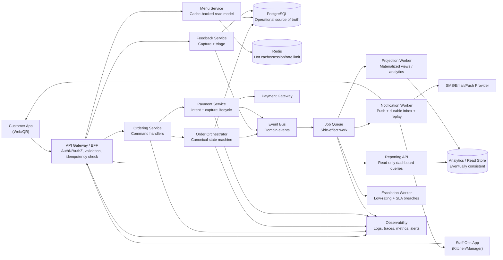

# Restaurant Ordering Platform - System Design (Hardened MVP)

## 1) Goals and Reliability Bar
This design keeps MVP simplicity while removing ambiguity in operational correctness.

Primary goals:
- Correct order state under retries, reconnects, and partial failures.
- Low-latency order placement and kitchen updates.
- Durable feedback and service-recovery workflows.
- Clear separation between operational truth and analytical read models.

## 2) Architectural Principles
1. Single state mutation authority for order lifecycle.
- Only the Order Orchestrator can transition order state.
- API layer never mutates order state directly.

2. Commands, events, and jobs are distinct.
- Commands: synchronous intent (`CreateOrder`, `MarkReady`).
- Domain events: immutable facts (`OrderCreated`, `OrderReady`).
- Jobs: async side effects (`SendSMS`, `RebuildDailyAggregate`).

3. Operational vs analytical separation.
- Operational truth lives in PostgreSQL.
- Analytics/read models are derived and eventually consistent.

4. Idempotency everywhere on critical paths.
- Order create, payment confirm, status transition, notifications.

5. Tenant boundary is explicit.
- `restaurant_id` scoped in auth, routing, storage, cache keys, and metrics.

## 3) System-Level Diagram

## 4) Component Responsibilities
1. API Gateway / BFF
- Authenticates users and enforces role + tenant scope.
- Validates payload shape and idempotency keys.
- Routes to domain services.

2. Ordering Service + Order Orchestrator
- Ordering service accepts commands.
- Orchestrator enforces legal state transitions only.
- Writes canonical order state and emits domain events.

3. Payment Service
- Owns payment state machine and PSP interactions.
- Maps payment states to order command outcomes.

4. Menu Service
- Serves hot menu reads from Redis-backed model.
- Handles availability windows, sold-out flags, and modifier rules.

5. Feedback Service
- Persists feedback and emits triage/escalation events.

6. Reporting API
- Read-only access to derived analytics/materialized views.
- Not used for hot operational decisions.

## 5) Canonical State Models
### 5.1 Order State
`CREATED -> PAYMENT_PENDING -> PAID -> ACCEPTED -> PREPARING -> READY -> DELIVERED`

Failure/terminal states:
- `PAYMENT_FAILED`
- `CANCELLED`
- `EXPIRED`

Rules:
- Transition checks live only in orchestrator.
- Every transition appends an immutable `order_status_event`.

### 5.2 Payment State
`PENDING -> AUTHORIZED -> CAPTURED`

Failure/terminal states:
- `FAILED`
- `EXPIRED`
- `REFUNDED`

Rules:
- Client retries must reuse idempotency key.
- Duplicate callbacks are safe and no-op after terminal state.

## 6) Core Flows (Command -> Event -> Job)
### A) Create Order
1. Client sends `CreateOrder` with `Idempotency-Key`.
2. BFF validates tenant/auth/shape and forwards command.
3. Payment service creates or reuses payment intent.
4. Orchestrator writes order + initial state in one transaction.
5. Orchestrator emits `OrderCreated`/`OrderPaid` events.
6. Jobs fan out to notification and kitchen projection workers.

### B) Kitchen Status Update
1. Staff sends `MarkPreparing`/`MarkReady` command.
2. BFF authorizes staff role for that `restaurant_id`.
3. Orchestrator validates transition and persists event.
4. `OrderStatusChanged` event triggers push + pull update surfaces.

### C) Feedback Escalation
1. Customer submits feedback tied to `order_id`.
2. Feedback service persists and emits `FeedbackSubmitted`.
3. Escalation worker applies rules (`rating <= 2`, SLA breach, keywords).
4. Durable alert is created for manager inbox; notification sent.

## 7) Data and Tenant Model
Required multi-tenant constraints:
- Every domain table includes `restaurant_id`.
- Composite uniqueness scoped by tenant (example: `(restaurant_id, external_order_ref)`).
- Cache keys prefixed with tenant (`rest:{restaurant_id}:menu:*`).
- JWT claims include tenant scope.

Core tables:
- `orders`, `order_items`, `order_status_events`
- `payments`, `payment_events`
- `feedback`, `feedback_actions`
- `menu_items`, `menu_modifiers`, `menu_availability_windows`
- `notification_events`, `alert_inbox`

## 8) Reliability Controls
1. Idempotency
- `idempotency_keys` table tracks request hash, actor, tenant, response pointer, TTL.

2. Event delivery
- Each domain event has globally unique `event_id`.
- Consumers store last processed offset/id for replay-safe processing.

3. Notification durability
- Push + pull hybrid: websocket/SSE for live, REST pull for recovery.
- Staff/client reconnect with `last_seen_event_id` to replay missed events.

4. Offline behavior
- Staff app keeps local cache of active tickets.
- Reconnect triggers delta sync and stale-state banner until caught up.
- Mutating actions are command-based and conflict-checked server-side.

5. Payment reconciliation
- Scheduled reconciliation compares PSP ledger vs internal `payments`.
- Mismatches create operational alerts.

## 9) Observability (First-Class)
Required telemetry:
- Correlation IDs on every command/event/job.
- Distributed traces for checkout and kitchen update paths.
- Queue lag, dead-letter counts, and retry metrics.
- Order SLA metrics (`time_to_accept`, `time_to_ready`, breach rate).
- Notification delivery success by channel.
- Payment failure and reconciliation mismatch alerts.

## 10) Deployment Shape (MVP -> Scale)
MVP deployment:
- One deployable backend with modular services, single PostgreSQL, Redis, event bus + workers.

Scale-out path:
- Split Ordering, Payment, Menu, Feedback, Reporting into independently deployable services.
- Keep BFF as stable external contract.
- Scale workers separately by workload class (notification, projections, escalations).
